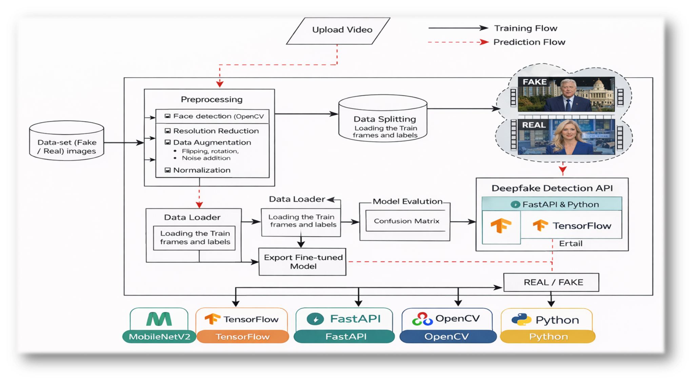

# 🎭 Deepfake Video Detection System


A deep learning-based system that detects whether a video is **REAL or FAKE (deepfake)** using a CNN-based model with a complete pipeline including preprocessing, model inference, API deployment, and user interface.

---

## 🧠 Architecture Overview




---

## 🧠 Model Design Choice

Initially, pretrained convolutional neural network architectures such as MobileNetV2 and ResNet were evaluated for this task. However, due to the relatively limited dataset size and the high complexity of these models, they exhibited significant overfitting and poor generalization on validation data.

To address this issue, a custom lightweight CNN architecture was designed. This allowed better control over model capacity, reduced overfitting, and achieved more stable and reliable performance on unseen data.

This design choice highlights the importance of selecting models appropriate to dataset scale and complexity, rather than relying solely on deeper pretrained architectures.

---

## 🚀 Features

* 🎥 Video-based deepfake detection
* 🧠 CNN model trained on real vs fake frames
* ⚡ FastAPI backend for real-time prediction
* 🌐 Streamlit UI for interactive usage
* 🖼️ Frame-level analysis using OpenCV
* 📊 Aggregated prediction for final result

---

## 🏗️ Project Structure

```bash
Deepfake_Video/
│── FastAPI/              # Backend API (inference)
│── Streamlit/            # Frontend UI
│── Scripts/              # Training & preprocessing
│── models/               # Trained model (.keras)
│── Datasetlink.txt       # Dataset + model links
│── requirements.txt
│── .gitignore
│── README.md
```

---

## 🔄 System Workflow

### 🔹 Training Flow

1. Load dataset (Real & Fake frames)
2. Preprocessing:

   * Face detection (OpenCV)
   * Resolution normalization
   * Data augmentation
3. Data splitting (train/validation)
4. Model training (CNN)
5. Evaluation using confusion matrix
6. Export trained model

---

### 🔹 Prediction Flow

1. Upload video via UI
2. Extract frames using OpenCV
3. Preprocess frames
4. Pass frames to trained model
5. Aggregate predictions
6. Output: **REAL / FAKE + confidence score**

---

## 🧠 Model Details

* Model Type: Convolutional Neural Network (CNN)
* Input Shape: 128 × 128 × 3
* Framework: TensorFlow / Keras
* Output: Binary Classification (Real / Fake)

---

## ⚙️ Installation

### 1. Clone Repository

```bash
git clone https://github.com/Kshitij-Chandrakar/Projects/deepfake-video-detection.git
cd deepfake-video-detection
```

### 2. Install Dependencies

```bash
pip install -r requirements.txt
```

---

## ▶️ Running the Project

### 🔹 Start FastAPI Backend

```bash
uvicorn FastAPI.app:app --reload
```

API URL: http://127.0.0.1:8000

---

### 🔹 Start Streamlit Frontend

```bash
streamlit run Streamlit/app.py
```

---

## 📡 API Endpoint

### POST `/predict`

**Input:** Video file
**Output:**

```json
{
  "prediction": "FAKE",
  "confidence": 0.91
}
```

---

## 📁 Dataset and Model

Details available in:

```
Datasetlink.txt
```

* Dataset (Real/Fake videos or frames)

---

## 🛠️ Tech Stack

* Python
* TensorFlow / Keras
* OpenCV
* FastAPI
* Streamlit

---

## 📊 Evaluation

* Confusion Matrix
* Accuracy & Validation Metrics
* Frame-level prediction aggregation

---

## 🔮 Future Improvements

* 🔁 Add LSTM for temporal learning
* 📈 Use pretrained models (ResNet, EfficientNet)
* ☁️ Deploy on cloud (AWS / Hugging Face)
* 🎯 Real-time detection system

---

## 👨‍💻 Authors

- **Kshitij Chandrakar** – B.Tech CSE | AI/ML Enthusiast  
- **Aditya Jha** – B.Tech CSE | AI/ML Enthusiast  

---

## 📜 License

This project is licensed under the MIT License - see the LICENSE file for details.
